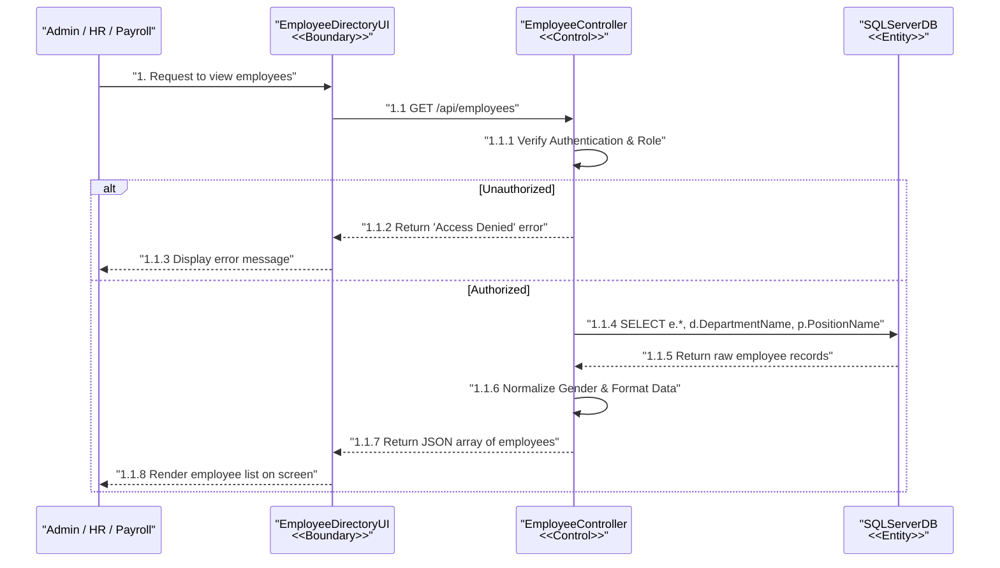
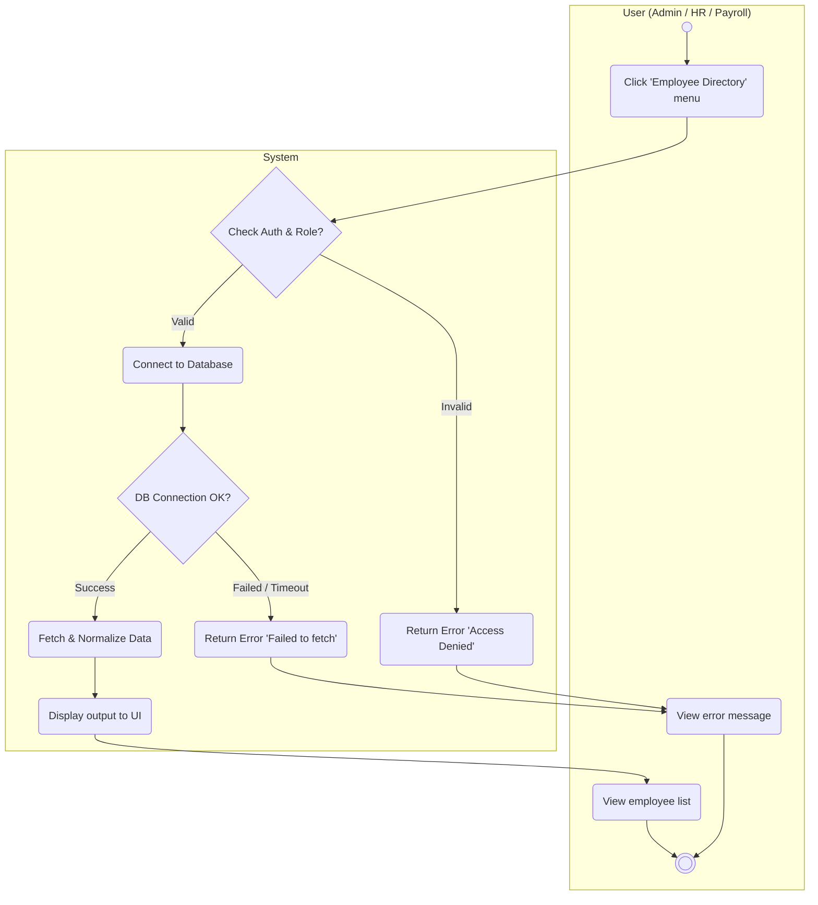
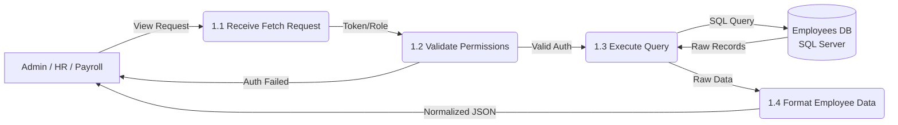
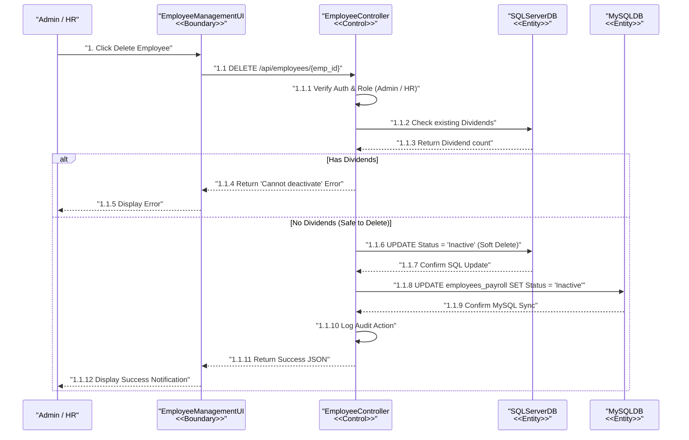
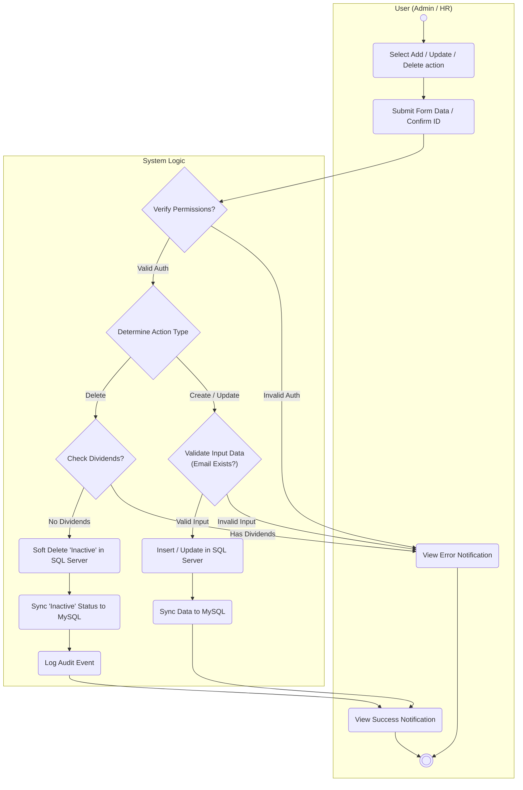

# HR Module - Employee Management Diagrams

Tài liệu này chứa các sơ đồ (Sequence, Activity, DFD Level 2) cho các chức năng **Employee Directory** và **Employee CRUD** thuộc phân hệ Quản lý Nhân sự (HR). Các sơ đồ được thiết kế tuân thủ nghiêm ngặt theo chuẩn `ruleDiagram.md`.

---

## 1. Chức năng: Employee Directory (Danh sách Nhân viên)

Chức năng này cho phép người dùng (Admin, HR, Payroll) xem danh sách toàn bộ nhân viên trong công ty.

### 1.1. Sequence Diagram
**Tuân thủ Rule:** Boundary -> Control -> Entity. Các message trả về dùng nét đứt (`-->>`).

### 1.2. Activity Diagram
**Tuân thủ Rule:** Phân làn rõ ràng. Điểm kết thúc (Finish) phải nằm ở phía User sau khi nhận kết quả từ hệ thống.

### 1.3. DFD Level 2 (Data Flow Diagram)
**Tuân thủ Rule:** Đánh số phân cấp, hiển thị External Entity (Admin/HR/Payroll) và Data Store để map luồng dữ liệu chi tiết.

---

## 2. Chức năng: Employee CRUD (Thêm, Sửa, Xóa Nhân viên)

Chức năng này cho phép Admin và HR quản lý thông tin nhân viên.

### 2.1. Sequence Diagram (Employee Delete)
*Quy trình Delete Employee với các validation rule và cơ chế đồng bộ CSDL.*

### 2.2. Activity Diagram (Employee CRUD - General Flow)
**Tuân thủ Rule:** Phân làn, điểm kết thúc (Finish) phải nằm ở phía User sau khi xem thông báo kết quả.

### 2.3. DFD Level 2 (Data Flow Diagram cho Employee CRUD)
**Tuân thủ Rule:** Số hóa chi tiết luồng CRUD (2.x), hiển thị các Data Store.

```mermaid
graph LR
    %% External Entity
    Actor["Admin / HR"]
    
    %% Data Stores
    DB_SQL[("Employees DB <br/> SQL Server")]
    DB_MySQL[("Payroll DB <br/> MySQL")]
    DB_Audit[("Audit Logs DB")]

    %% Processes
    P2_1("2.1 Submit CRUD Request")
    P2_2("2.2 Verify Authorization")
    P2_3("2.3 Validate Business Rules")
    P2_4("2.4 Execute Primary Action")
    P2_5("2.5 Sync Payroll Data")
    P2_6("2.6 Write Audit Log")

    %% Flow Mapping
    Actor -- "Employee Data / ID" --> P2_1
    P2_1 -- "Request Payload" --> P2_2
    P2_2 -- "Auth Failed" --> Actor
    P2_2 -- "Authorized Request" --> P2_3
    
    P2_3 -- "Validation Query" --> DB_SQL
    DB_SQL -- "Results" --> P2_3
    P2_3 -- "Validation Failed" --> Actor
    
    P2_3 -- "Validated Payload" --> P2_4
    P2_4 -- "DB Update" --> DB_SQL
    DB_SQL -- "Success" --> P2_4
    
    P2_4 -- "Sync Data" --> P2_5
    P2_5 -- "MySQL Update" --> DB_MySQL
    DB_MySQL -- "Done" --> P2_5
    
    P2_5 -- "Event" --> P2_6
    P2_6 -- "Audit Entry" --> DB_Audit
    
    P2_6 -- "Success Response" --> Actor
```

